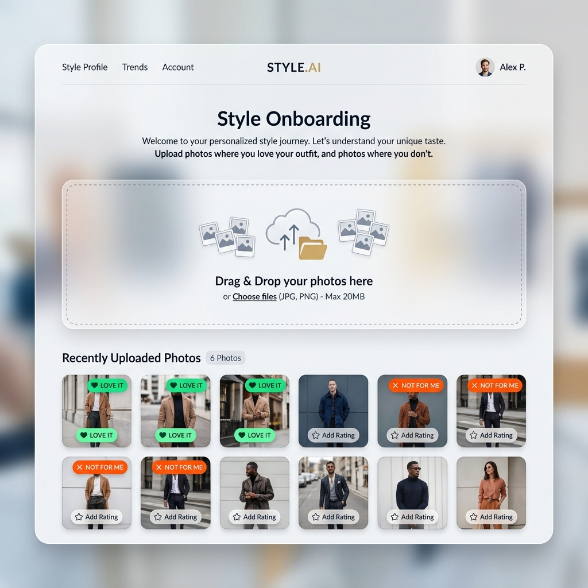
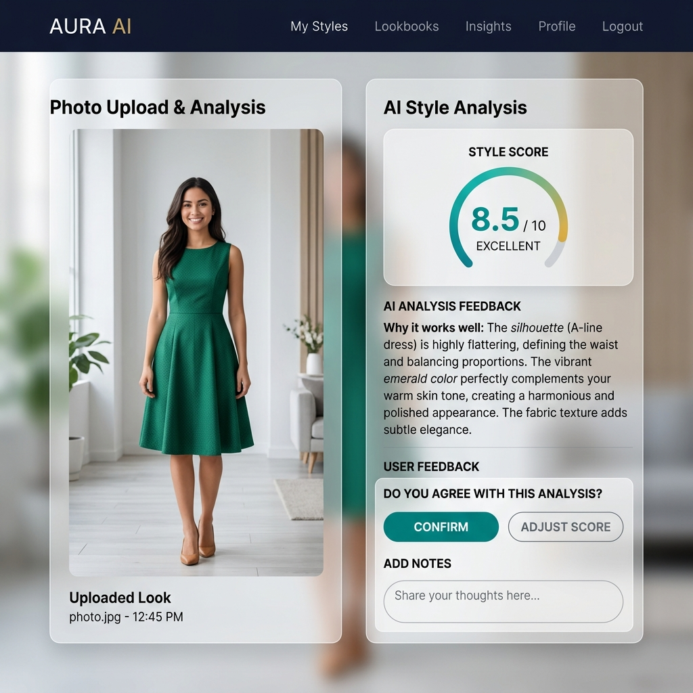
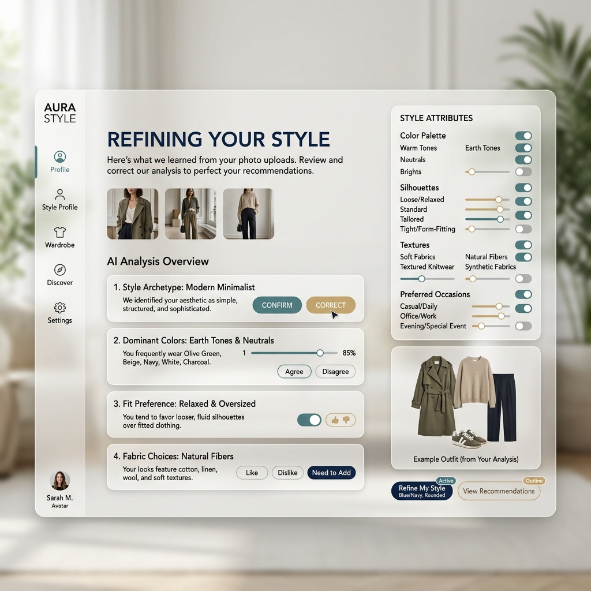
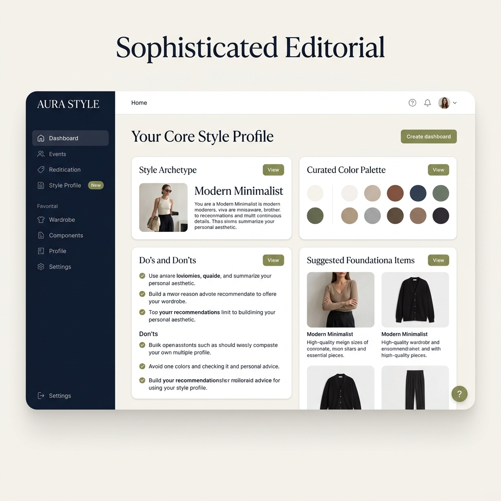
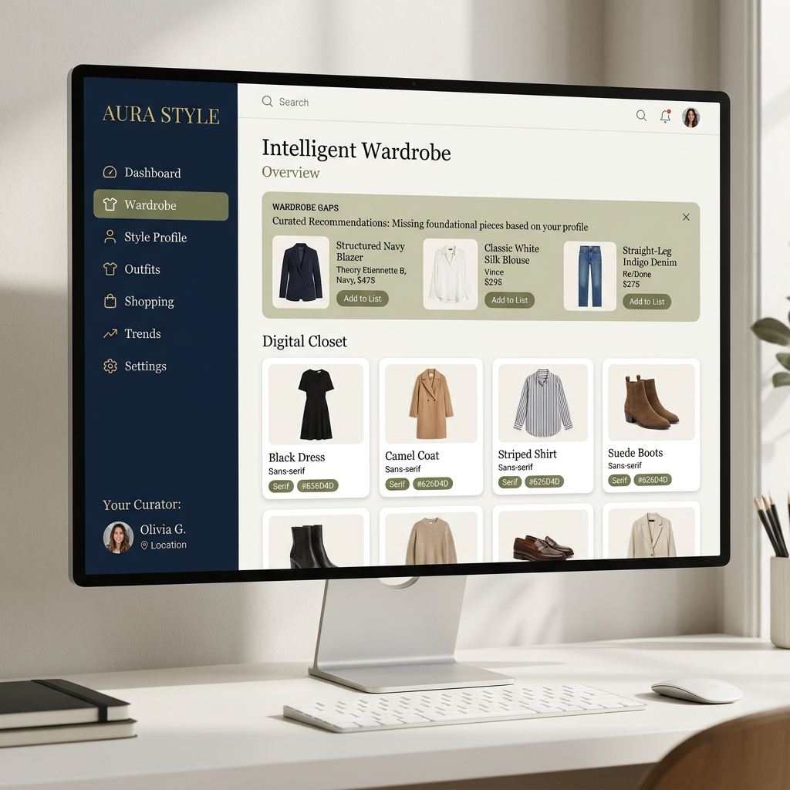
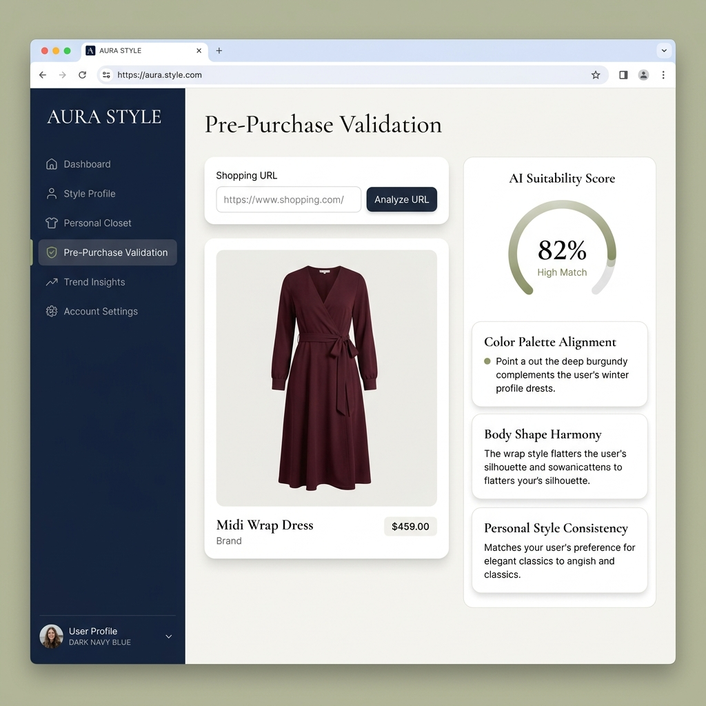
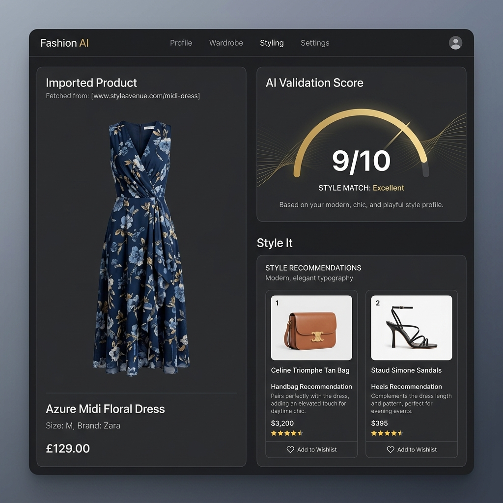
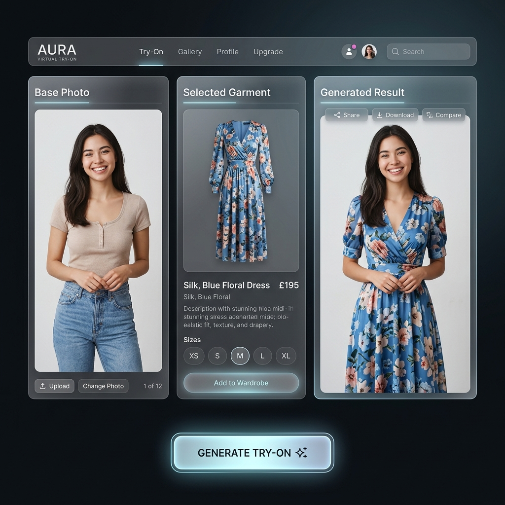
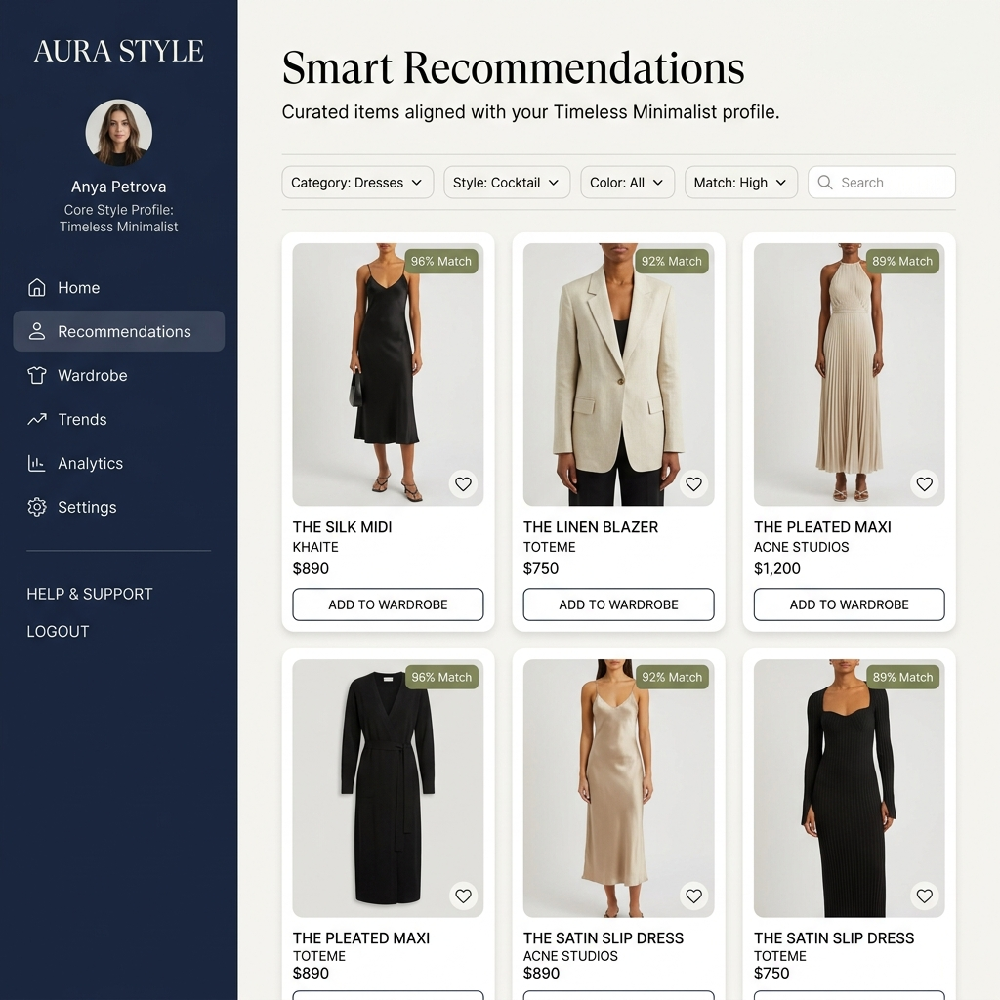

## Aura Style (AI Personal Stylist)

## 1. Executive Summary
Aura Style is an AI-powered personal stylist application designed to help users refine their aesthetic, manage their wardrobes intelligently, and make smarter purchasing decisions. Unlike generic fashion apps, Aura Style acts as an analytical, personalized advisor. It learns a user's unique style through photo uploads and interactive feedback, generates a definitive "Core Style Profile", and uses this profile as the ultimate source of truth to power features like virtual try-ons, wardrobe gap analysis, and pre-purchase validation. The goal is to empower users to build a cohesive, intentional wardrobe over time.

---

## 2. Core Use Cases & Requirements

### Aura AI - Your Personal Stylist Assistant
*Establishing the user's aesthetic and analyzing their current inventory.*

#### Interactive Style Profiling (Onboarding)
**Objective:** Capture user preferences and generate a personalized Style Profile.
**Requirements:**
1. **Bulk Upload:** Allow users to drag-and-drop multiple "good" and "bad" outfit photos.
2. **AI Scoring:** Process photos to extract preliminary style metrics (colors, fits).
3. **Interactive Feedback:** Present AI inferences to the user and allow them to correct/confirm assumptions (e.g., "Do you prefer earth tones?").
4. **Profile Generation:** Generate a definitive Style Profile dashboard outlining the user's Archetype, Color Palette, and Do's/Don'ts.

**Associated Mockups:**
*Step 1: Uploading Photos*

*Step 2: AI Scoring*

*Step 3: Interactive Feedback*

*Step 4: The Final Core Style Profile*

####  Intelligent Virtual Wardrobe & Gap Analysis
**Objective:** Digitally catalog the user's clothing and identify missing foundational pieces.
**Requirements:**
1. **Digital Closet:** Display uploaded clothing items in a clean, categorized grid.
2. **Gap Analysis:** Automatically cross-reference the user's digital closet with their Style Profile to identify essential missing items.
3. **Alerts:** Display "Wardrobe Gaps" prominently at the top of the dashboard.

**Associated Mockup:**

---

### Aura AI - Your Personal Shopping Assistant
*Decision-support tools for smarter styling and purchasing.*

#### Pre-Purchase Validation
**Objective:** Prevent buyer's remorse by scoring potential purchases against the user's profile.
**Requirements:**
1. **URL Input:** Allow the user to paste a URL of a clothing item they are considering buying.
2. **Suitability Scoring:** The AI evaluates the item and provides a Match Score (0-100%).
3. **Detailed Breakdown:** Explain exactly *why* the item matches or clashes (e.g., color compatibility, silhouette fit).

**Associated Mockup:**

####  Outfit & Accessory Styling
**Objective:** Help users build complete outfits around a specific garment.
**Requirements:**
1. Select any item from the Virtual Wardrobe.
2. The AI suggests complementary pants, shoes, and accessories to complete the look.

**Associated Mockup:**

####  Virtual Try-On
**Objective:** Visually demonstrate how a selected garment will look on the user.
**Requirements:**
1. Utilize a vision API (e.g., IDM-VTON) to overlay a selected garment onto a base photo of the user.
2. Provide a side-by-side or slider comparison.

**Associated Mockup:**

---

### Aura - Your Personal Discovery Assistant
*Finding new inspiration.*

####  Smart Recommendations
**Objective:** Provide a highly curated shopping feed tailored to the user's specific aesthetic.
**Requirements:**
1. Automatically fetch and display garments from the web that align with the user's Style Profile and fill their Wardrobe Gaps.
2. Display a specific Match Score badge on every recommended item.
3. Allow users to add these items directly to their virtual wardrobe or wish list.

**Associated Mockup:**

---

### Aura AI - The Omnipresent Chat Assistant
*Bringing your wardrobe data to life through conversation.*

#### "Ask Aura" Conversational Stylist
**Objective:** Provide a persistent, hyper-personalized chat interface that leverages the user's wardrobe data to offer styling advice.
**Requirements:**
1. **Context Awareness:** Silently feed the user's Core Style Profile, Virtual Wardrobe inventory, and Wardrobe Gaps as context to the AI for every query.
2. **Event Styling:** Allow users to ask for outfit recommendations from their existing closet for specific events (e.g., "What should I wear to a cocktail party?").
3. **Purchase Advice:** Allow users to ask for second opinions on items before buying, checking against their Do's and Don'ts.
4. **Packing Assistant:** Generate mix-and-match capsule wardrobes from the user's closet for upcoming trips.
5. **UI Integration:** Implement as a persistent, floating chat window accessible from any screen within the application.
